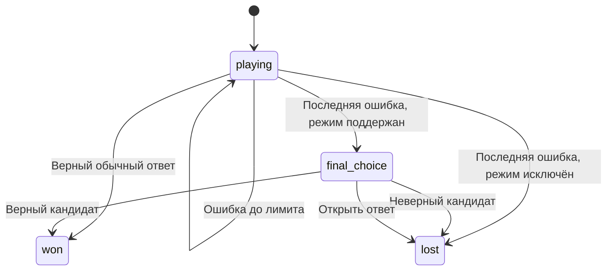
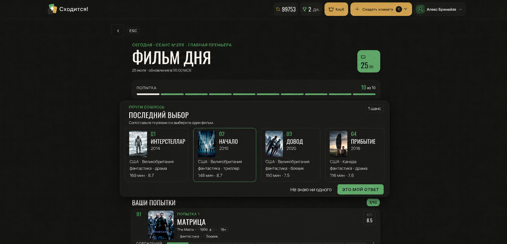

# Техническое задание: «Финальная сверка» для игр «Сходится!»

Версия: 1.0  
Дата: 25 июля 2026  
Актуальная база: `SaborataRekaReka/shoditsa`, ветка `main`, коммит `a39c7b78114d6fdfdee0f9068772a4b3346b4040`  
Интерфейсная база: [shoditsa.ru/ui-kit](https://shoditsa.ru/ui-kit), `docs/UI_DESIGN_GUIDELINES.md`, текущий `GamePageFrame`

## 1. Краткая формулировка

Добавить в каталоговые угадайки финальный этап после последней неудачной обычной попытки.

Текущий цикл:

> до 10 попыток → десятая ошибка → `lost` → раскрытие ответа → начисление награды

Новый цикл:

> до 10 попыток → десятая ошибка → `final_choice` → 4 кандидата → одно итоговое действие → результат

В финальном списке находятся:

- правильный ответ;
- три правдоподобных ложных кандидата;
- у всех четырёх кандидатов показаны одинаковые по смыслу группы признаков;
- игрок выбирает один вариант и подтверждает его;
- альтернативное действие — открыть ответ, если ни один вариант ничего ему не говорит.

Свободный поиск и новые обычные попытки на этом этапе недоступны.

## 2. Цель

Дать игроку возможность завершить дедукцию, даже когда точное название ему незнакомо, и превратить провальную партию в понятную кульминацию.

Финальная сверка должна:

- сохранять основную механику первых десяти попыток;
- использовать уже открытые сравнительные подсказки;
- позволять сопоставлять реальные характеристики четырёх кандидатов;
- исключать случайный или очевидный набор вариантов;
- сохранять дневное прохождение и серию после любого итогового действия;
- отличать самостоятельную победу от победы через финальный список;
- работать одинаково во всех семи каталоговых режимах.

## 3. Область действия

### 3.1. Включённые режимы

Функция обязательна для всех режимов с `engine: 'catalog_guess'`:

| ID | Режим |
|---|---|
| `movie` | Кино |
| `series` | Сериалы |
| `anime` | Аниме |
| `game` | Игры |
| `city` | Города |
| `music` | Музыка |
| `diagnosis` | Диагнозы |

Функция должна работать в:

- ежедневной игре `daily`;
- архиве `archive`;
- свободной игре `free_play`;
- каталоговых спецпоказах `pack`, если для конкретного спецпоказа не задано исключение.

Для обычных режимов финальный этап наступает после 10-й ошибки. В общей реализации использовать `session.maxAttempts`, поскольку пакетный runtime уже поддерживает собственное число попыток.

### 3.2. Явные исключения

1. **Данетки**
   - `mode === 'danetki'`;
   - `engine === 'danetki_chat'`;
   - остаются на собственном чат-движке;
   - endpoint финальной сверки должен отвечать `422 GAME_ACTION_ENGINE_MISMATCH`.

2. **Спецпоказ DTF**
   - `packId === 'dtf-game-comments-25-v1'`;
   - после последней ошибки сохраняется текущая логика завершения;
   - `FinalChoicePanel` не рендерится;
   - исключение должно использовать серверную константу `DTF_COMMENTS_PACK_ID` из `apps/api/src/modules/packs/policy.ts`;
   - вторую строковую копию идентификатора не создавать.

### 3.3. Отдельные игровые движки

Комнаты с друзьями используют `friends_rooms`, раунды и собственный цикл ответов. Изменения в этом ТЗ относятся к `game_sessions` и стандартному экрану `/sessions/:sessionId`.

### 3.4. Hosted и автономный runtime

- На `shoditsa.ru` источником истины является API и PostgreSQL.
- В сборке `yandex` тот же UX должен работать через общий алгоритм из `packages/game-core`; состояние хранится в расширенном `SavedGame`.
- Визуальный компонент должен быть общим для обоих контроллеров.

## 4. Термины и результаты

| Термин | Значение |
|---|---|
| Обычная попытка | Ответ через текущий `SearchCombobox` |
| Прямое решение | Верный ответ в обычной попытке 1–10 |
| Финальная сверка | Этап с четырьмя кандидатами после последней ошибки |
| Финальное решение | Верный кандидат в финальной сверке |
| Ошибка сверки | Выбран неверный кандидат |
| Открытие ответа | Игрок выбрал «Не знаю ни одного» |

Терминальные типы завершения:

```ts
export type GameCompletionType =
  | 'direct_win'
  | 'final_choice_win'
  | 'final_choice_loss'
  | 'answer_revealed'
  | 'attempts_exhausted'
  | 'expired'
```

`attempts_exhausted` остаётся для исключённых сценариев, в частности спецпоказа DTF.

## 5. Сценарий игрока



### 5.1. Переход в финальную сверку

После последней неправильной обычной попытки:

1. Попытка сохраняется как десятая.
2. Сравнительные подсказки для неё показываются в истории.
3. `SearchCombobox` исчезает.
4. Сеанс получает `status: 'final_choice'`.
5. Сервер возвращает стабильный набор из четырёх кандидатов.
6. Ответ, награда, `completedAt` и дневное завершение пока не возвращаются.
7. Экран прокручивается к заголовку `FinalChoicePanel`, а заголовок получает программный фокус.

### 5.2. Выбор кандидата

1. Игрок отмечает одну карточку.
2. Кнопка «Это мой ответ» становится активной.
3. До подтверждения игрок может менять выделенную карточку.
4. После подтверждения выбор необратим.
5. Во время запроса все карточки и действия блокируются.
6. При сетевой ошибке выделение сохраняется, а тот же idempotency key используется для безопасного повтора.

### 5.3. Открытие ответа

Действие «Не знаю ни одного» открывает компактный `DialogSurface`:

> **Открыть правильный ответ?**  
> Финальная сверка завершится, вернуться к выбору уже не получится.

Действия:

- `Остаться и выбрать` — закрыть диалог;
- `Открыть ответ` — завершить игру с `answer_revealed`.

### 5.4. Возврат в незавершённый сеанс

Если пользователь обновил страницу или вернулся позже:

- сервер снова отдаёт тот же порядок кандидатов и те же признаки;
- экран сразу открывается в `final_choice`;
- локальное предварительное выделение можно сбросить;
- обычный поиск и подсказки после 5/8 попыток остаются недоступны;
- уже открытые подсказки и вся история попыток остаются видимыми.

## 6. Экран «Последний выбор»

### 6.1. Референс композиции



Референс фиксирует направление композиции:

- тёмная общая поверхность;
- четыре компактных карточки;
- постер как главный визуальный якорь;
- короткие признаки без табличной разлиновки;
- одна зелёная рамка выбранного кандидата;
- одно основное подтверждающее действие.

Данные в референсе иллюстративные. В реализации счётчик истории под панелью должен показывать `10/10`, а история должна содержать все десять попыток.

### 6.2. Положение на странице

Существующий `GamePageFrame`, `AppHeader`, кнопка назад, заголовок режима и ширина `GameScreenShell` не меняются.

Порядок блоков в `final_choice`:

1. `game-heading`;
2. анамнез или уже открытые служебные подсказки;
3. `SegmentedProgress` со значением `maxAttempts / maxAttempts`;
4. `FinalChoicePanel`;
5. существующий `GameMatchStrip`, раскрытый по умолчанию;
6. секция «Ваши попытки» с десятью карточками.

Панель находится в обычном потоке. Большую панель целиком не закреплять при прокрутке.

### 6.3. Текст

Кикер:

> ПОЧТИ СОШЛОСЬ

Заголовок:

> ПОСЛЕДНИЙ ВЫБОР

Описание:

> Все сравнительные подсказки уже на экране. Сопоставьте их с вариантами и выберите один.

Статус:

> 1 ВЫБОР

Основная кнопка:

> ЭТО МОЙ ОТВЕТ

Вторичное действие:

> НЕ ЗНАЮ НИ ОДНОГО

Текст не должен зависеть от рода ответа: не использовать «один фильм», «один город» и подобные формулировки.

### 6.4. Карточка кандидата

Каждая карточка содержит:

1. постер или существующий fallback из `TitlePoster`;
2. название;
3. основную мету режима;
4. ровно три компактные строки признаков;
5. индикатор выбранного состояния.

Принципы:

- у всех четырёх карточек используются одни и те же группы признаков и одинаковый порядок;
- признаки не получают зелёную, жёлтую или красную оценку;
- совпадения с правильным ответом не передаются клиенту;
- подписи в стиле `СТРАНА / ЖАНРЫ / РЕЙТИНГ` не повторяются в каждой карточке;
- обозначение добавляется внутрь значения только при необходимости: `КП 8,7`, `Steam 93%`, `GMT+3`, `Экономика №12`;
- название ограничено двумя строками;
- строка признака ограничена одной строкой с корректным `text-overflow`;
- полное содержимое доступно в `aria-label`;
- длинные значения форматируются и сокращаются на сервере по общему контракту.

### 6.5. Состояния карточки

| Состояние | Требование |
|---|---|
| Default | `var(--color-line)`, `var(--color-surface-2)` |
| Hover | усиление границы без изменения размеров |
| Focus-visible | штатный фокус UI kit |
| Selected | `var(--color-primary-border)`, мягкий primary-фон, иконка `Check` |
| Disabled / pending | снижение контраста, курсор и повторный ввод заблокированы |
| Image error | `TitlePoster` показывает режимный fallback |

Цвет не является единственным признаком выбора: обязательны рамка и `Check`.

### 6.6. Адаптивность

| Viewport | Сетка |
|---|---|
| 390–719 px | 2 × 2 |
| 720–899 px | 2 × 2 с увеличенными карточками |
| от 900 px | 4 карточки в один ряд |

Дополнительные требования:

- горизонтальный scroll страницы запрещён;
- touch target каждой карточки и каждого действия — минимум 44 px;
- на mobile основная кнопка занимает всю ширину;
- вторичное действие располагается под основной кнопкой;
- на desktop действия выравниваются справа в нижней части панели;
- содержимое должно проверяться на 390, 768, 1024, 1280, 1440 и 1680 px;
- `prefers-reduced-motion` отключает входную анимацию и перемещение.

### 6.7. UI kit и компоненты

Использовать:

- `GamePageFrame`;
- `SegmentedProgress`;
- `TitlePoster`;
- `ControlButton` для интерактивной карточки;
- `ActionButton` для подтверждения;
- `TextButton` для открытия ответа;
- `StatusBadge` для «1 выбор»;
- `DialogSurface` для подтверждения открытия ответа;
- `InlineAlert` для ошибки.

Добавить общий компонент:

```text
apps/web/src/features/game-session/FinalChoicePanel.tsx
apps/web/src/features/game-session/FinalChoicePanel.css
```

Разметку карточек и базовые controls не размещать непосредственно в `App.tsx`.

Добавить живой specimen `FinalChoicePanel` на `/ui-kit` и обновить `docs/UI_DESIGN_GUIDELINES.md`, поскольку паттерн используется hosted- и yandex-контроллерами.

Использовать только токены из `apps/web/src/styles/tokens.css`. Новые hex-значения в feature CSS запрещены.

## 7. Какие данные показывать в разных режимах

У каждой четвёрки есть:

- одна основная мета;
- три одинаковые для всей четвёрки группы признаков;
- приоритеты выбора групп, перечисленные ниже.

| Режим | Основная мета | Приоритетные группы признаков |
|---|---|---|
| Кино | год | страны; жанры; хронометраж + КП/IMDb; возраст |
| Сериалы | год или период выхода | страны; жанры; сезоны + статус; КП/IMDb |
| Аниме | год | формат + статус; жанры; эпизоды; студия; Shikimori |
| Игры | год | жанры; платформы; разработчик; Steam + Metacritic; число игроков |
| Музыка | начало деятельности или десятилетие | страна; жанры; тип + сцена; активность |
| Города | страна | континент + языки; население + часовой пояс; показатели Oxford |
| Диагнозы | группа МКБ-10 | системы организма; ключевые симптомы; течение + возраст; диагностика |

Примеры компактного отображения:

```text
США · Великобритания
фантастика · драма
148 мин · КП 8,7
```

```text
Windows · PlayStation
RPG · тактика
Steam 93% · MC 87
```

```text
Сердечно-сосудистая
одышка · отёки
хроническое · взрослые
```

Для городов и диагнозов `TitlePoster` уже умеет показывать герб, флаг или системную медицинскую иконку. Отдельные локальные заглушки создавать не требуется.

## 8. Выбор трёх отображаемых групп признаков

Для каждой конкретной четвёрки сервер выбирает три группы по следующим правилам:

1. Группа присутствовала среди `Hint.key` хотя бы в одной обычной попытке.
2. Значение можно сформировать для всех четырёх кандидатов.
3. Значения различаются хотя бы у двух кандидатов.
4. Группа помещается в компактную строку после форматирования.
5. При наличии данных выбрать минимум:
   - одну категориальную группу;
   - одну числовую или порядковую группу;
   - одну дополнительную наиболее различающую группу.
6. `year` или режимная основная мета участвует в сравнении отдельно и не занимает одну из трёх строк.
7. `plotHint`, `description`, `comments`, редакторские заметки и закрытые поля не используются.

Если валидных общих групп меньше трёх, набор кандидатов считается неготовым и выбирается другой набор.

## 9. Принцип подбора четырёх кандидатов

### 9.1. Итоговая структура

```text
правильный ответ
+ ловушка по категориальным признакам
+ ловушка по числовым признакам
+ ближайшая сбалансированная ловушка
```

Роли хранятся только на сервере и не отображаются игроку.

### 9.2. Исходный пул

Использовать тот же пул, из которого работает текущий сеанс:

- тот же `revisionId`;
- тот же `mode`;
- тот же `period`;
- та же `difficulty` для музыки;
- тот же `variantKey` для городов;
- тот же pack pool для поддержанных спецпоказов.

Для получения пула переиспользовать `answerPool` и `poolFor`.

Исключить:

- все десять уже названных игроком объектов;
- отключённые `allowedInGame`;
- другой режим, период, сложность или вариант;
- дубликаты по `canonicalId` / `canonicalGameId`;
- альтернативные издания одной игры;
- объекты с пересекающимися `normalizedAnswers`, если из-за этого возможны два корректных ответа;
- сам ответ на этапе поиска ложных кандидатов.

### 9.3. Оценка близости

Для каждой пары `candidate → answer` переиспользовать результат `compareTitles(candidate, answer)`.

Оценивать только основную мету и три группы, которые будут показаны игроку:

| Статус `Hint` | Балл |
|---|---:|
| `match` | 1.00 |
| `close` | 0.70 |
| `partial` | 0.60 |
| `miss` | 0.00 |
| `unknown` | поле недоступно |

Вес конкретного ключа задаётся в исчерпывающем `FINAL_CHOICE_MODE_CONFIG`.

Популярность и узнаваемость используются как фильтр качества:

- ложные варианты должны находиться в сопоставимом `recognitionLevel`;
- при наличии числового рейтинга допустим соседний уровень;
- скрытая узнаваемость не является основной причиной близости.

### 9.4. Роли ложных кандидатов

**Категориальная ловушка**

- совпадает или частично совпадает минимум по двум категориальным группам;
- расходится по одному числовому или порядковому признаку.

**Числовая ловушка**

- близка по году, длительности, рейтингу, числу эпизодов, населению или рангу;
- расходится минимум по одной категориальной группе.

**Сбалансированная ловушка**

- имеет лучший общий балл среди оставшихся;
- её набор расхождений отличается от первых двух ловушек.

### 9.5. Обязательные ограничения

- правильный ответ присутствует ровно один раз;
- каждый ложный кандидат сходится минимум по двум видимым группам;
- каждый ложный кандидат явно расходится минимум по одной видимой группе;
- только один вариант полностью соответствует совокупности открытых подсказок;
- три ложных кандидата имеют разные `mismatch signature`;
- максимум два кандидата могут относиться к одной франшизе, одному режиссёру, разработчику или другому доминирующему семейству;
- все четыре названия осмысленны для текущего уровня узнаваемости ответа;
- порядок карточек перемешивается детерминированно;
- позиция правильного ответа не зависит от режима, даты или роли.

### 9.6. Детерминированность

Seed:

```text
session.id + session.rulesVersion + finalChoiceAlgorithmVersion
```

Повторный `GET /games/:sessionId`, обновление страницы и сетевой retry обязаны возвращать тот же список, порядок и признаки.

### 9.7. Runtime без генеративного ИИ

Подбор не обращается к OpenAI и другим внешним моделям во время игры. Все вычисления выполняются по проверенным данным активной ревизии.

## 10. Предварительный банк кандидатов

Для стабильного качества у каждого ответа заранее формируется банк из 8–12 кандидатов:

- до 4 категориальных ловушек;
- до 4 числовых ловушек;
- до 4 сбалансированных ловушек.

Банк строится при подготовке контентной ревизии и проходит автоматическую проверку.

Предлагаемый модуль:

```text
packages/game-core/src/final-choice.ts
scripts/content/build-final-choice-index.ts
```

Runtime:

1. загружает банк ответа;
2. исключает уже использованные игроком варианты;
3. берёт по одному кандидату каждой роли;
4. при нехватке использует следующие записи банка;
5. только после этого запускает резервный расчёт по текущему пулу.

Необходим отчёт:

```text
var/final-choice-coverage-report.json
```

В отчёте:

- покрытие по режимам;
- ответы без 12 кандидатов;
- ответы без трёх разных ролей;
- неоднозначные наборы;
- кандидаты с недостаточными данными;
- распределение правильного ответа по позициям;
- доля runtime fallback.

Активация новой ревизии блокируется, если хотя бы один `dailyEligible` объект семи режимов не имеет валидного набора.

## 11. Модель данных

### 11.1. Статус сеанса

Расширить статус:

```ts
export type ApiGameStatus =
  | 'playing'
  | 'final_choice'
  | 'won'
  | 'lost'
  | 'expired'
```

Обновить check constraint `game_session_status_check`.

### 11.2. `game_sessions`

Добавить:

```text
completion_type text null
```

Допустимые значения соответствуют `GameCompletionType`.

Правила:

- `playing` и `final_choice` → `completion_type IS NULL`, `completed_at IS NULL`;
- терминальный статус → `completion_type IS NOT NULL`, `completed_at IS NOT NULL`;
- `attempts_count` остаётся равным 10 в финальной сверке;
- финальный выбор не записывается как 11-я обычная попытка.

### 11.3. Банк контентных кандидатов

Новая таблица `content_final_choice_candidates`:

| Поле | Тип |
|---|---|
| `revision_id` | uuid FK |
| `answer_item_version_id` | uuid FK |
| `candidate_item_version_id` | uuid FK |
| `role` | text |
| `score` | real |
| `match_keys` | text[] |
| `mismatch_keys` | text[] |
| `rank` | smallint |
| `algorithm_version` | integer |
| `created_at` | timestamptz |

Ограничения:

- unique `(answer_item_version_id, candidate_item_version_id, algorithm_version)`;
- `answer_item_version_id <> candidate_item_version_id`;
- `role IN ('categorical','numeric','balanced')`;
- index по `(answer_item_version_id, role, rank)`.

### 11.4. Снимок конкретного сеанса

Новая таблица `game_final_choices`:

| Поле | Тип |
|---|---|
| `session_id` | uuid PK/FK |
| `candidate_item_version_ids` | uuid[4] |
| `display_keys` | text[3] |
| `candidate_snapshot` | jsonb |
| `selected_item_version_id` | uuid nullable |
| `outcome` | text nullable |
| `generation_source` | text |
| `algorithm_version` | integer |
| `resolution_idempotency_key` | uuid nullable |
| `opened_at` | timestamptz |
| `resolved_at` | timestamptz nullable |

Допустимые `outcome`:

```text
correct
incorrect
revealed
```

`candidate_snapshot` содержит только публичные данные четырёх карточек. Поля `isCorrect`, `answerId`, внутренний score и роли в snapshot отсутствуют.

В `item` разрешены только `id`, `titleRu`, `titleOriginal` и `posterUrl`. Полный `PublicContentItem` в незавершённую финальную сверку не передавать.

### 11.5. Статистика

В `user_mode_stats` добавить:

```text
final_choice_wins integer not null default 0
```

Текущий `distribution` из десяти значений сохраняется для прямых решений на попытках 1–10. Победы через список отражаются отдельным показателем «В финальной сверке».

## 12. API-контракты

### 12.1. Новые типы

В `packages/contracts/src/api.ts`:

```ts
export type FinalChoiceFactSnapshot = {
  key: string
  value: string
  ariaLabel: string
}

export type FinalChoiceCandidateIdentity = {
  id: string
  titleRu: string
  titleOriginal?: string
  posterUrl?: string
}

export type FinalChoiceCandidateSnapshot = {
  item: FinalChoiceCandidateIdentity
  primaryMeta: string
  facts: [
    FinalChoiceFactSnapshot,
    FinalChoiceFactSnapshot,
    FinalChoiceFactSnapshot,
  ]
}

export type FinalChoiceSnapshot = {
  candidates: [
    FinalChoiceCandidateSnapshot,
    FinalChoiceCandidateSnapshot,
    FinalChoiceCandidateSnapshot,
    FinalChoiceCandidateSnapshot,
  ]
  displayKeys: [string, string, string]
  choicesRemaining: 1
}
```

В `GameSessionSnapshot` добавить:

```ts
completionType: GameCompletionType | null
finalChoice: FinalChoiceSnapshot | null
```

Контракт:

- `status === 'final_choice'` → `finalChoice !== null`, `answer === undefined`;
- `status === 'playing'` → `finalChoice === null`;
- терминальный статус → `answer` присутствует, `finalChoice` можно вернуть с `selectedItemId` только как итоговую информацию.

### 12.2. Ответ на последнюю обычную ошибку

`POST /api/v1/games/:sessionId/attempts` возвращает:

```json
{
  "attempt": {},
  "session": {
    "status": "final_choice",
    "attemptsCount": 10,
    "attemptsRemaining": 0,
    "maxAttempts": 10,
    "completionType": null,
    "finalChoice": {
      "candidates": [],
      "displayKeys": [],
      "choicesRemaining": 1
    }
  },
  "progressiveHints": []
}
```

В ответе отсутствуют:

- `answer`;
- `reward`;
- корректность каждого кандидата.

### 12.3. Новый endpoint

```text
POST /api/v1/games/:sessionId/final-choice
Idempotency-Key: <uuid>
```

Выбор:

```json
{
  "action": "choose",
  "itemId": "content-item-id"
}
```

Открытие ответа:

```json
{
  "action": "reveal"
}
```

Ответ:

```ts
export type FinalChoiceResponse = {
  session: Pick<
    GameSessionSnapshot,
    'status' | 'attemptsCount' | 'attemptsRemaining' | 'maxAttempts' | 'completionType'
  >
  answer: PublicContentItem
  selectedItemId: string | null
  correct: boolean
  reward: AttemptResponse['reward']
}
```

### 12.4. Ошибки

| Код | HTTP | Условие |
|---|---:|---|
| `GAME_FINAL_CHOICE_NOT_AVAILABLE` | 409 | сеанс не в `final_choice` |
| `GAME_FINAL_CHOICE_INVALID_CANDIDATE` | 422 | `itemId` отсутствует в сохранённой четвёрке |
| `GAME_FINAL_CHOICE_ALREADY_RESOLVED` | 409 | другое действие уже завершило сеанс |
| `GAME_FINAL_CHOICE_UNAVAILABLE` | 409 | набор не удалось сформировать |
| `GAME_ACTION_ENGINE_MISMATCH` | 422 | Данетки или другой движок |
| `GAME_FINAL_CHOICE_EXCLUDED` | 422 | спецпоказ DTF |

После 409 клиент обновляет `queryKeys.game(sessionId)` и показывает фактическое состояние сервера.

### 12.5. OpenAPI

Обновить:

- TypeBox schemas в `packages/contracts/src/schemas.ts`;
- exports типов;
- `docs/backend/openapi.json` через `npm run openapi:generate`;
- `docs/backend/API.md`.

## 13. Серверная логика

### 13.1. Изменение `submitAttempt`

Сейчас `apps/api/src/modules/games/service.ts` на последней ошибке:

- вычисляет `status = 'lost'`;
- вызывает `completeGame`;
- записывает `completedAt`;
- возвращает `answer` и `reward`.

Новая ветка:

```ts
if (isCorrect) {
  completeAsDirectWin()
} else if (position < maxAttempts) {
  keepPlaying()
} else if (isFinalChoiceEligible(session)) {
  const finalChoice = await createFinalChoiceSnapshot(...)
  setStatus('final_choice')
  returnWithoutAnswerOrReward(finalChoice)
} else {
  completeWithExistingLossFlow()
}
```

Создание `game_attempts` и `game_final_choices`, обновление `game_sessions` и формирование response snapshot выполняются в одной транзакции.

### 13.2. Eligibility

Единая серверная функция:

```ts
isFinalChoiceEligible(session) =
  isCatalogGuessModeId(session.mode)
  && session.packId !== DTF_COMMENTS_PACK_ID
```

Логику не дублировать на уровне отдельных режимов.

### 13.3. Разрешение финального выбора

Endpoint:

1. блокирует `game_sessions` и `game_final_choices` через `FOR UPDATE`;
2. проверяет владельца;
3. проверяет `status === 'final_choice'`;
4. обрабатывает idempotency replay;
5. валидирует выбранный ID;
6. сравнивает version ID с `answerItemVersionId`;
7. выставляет терминальный статус и `completion_type`;
8. вызывает `completeGame` с нужным reward profile;
9. записывает результат выбора;
10. завершает pack progress, дневную посещаемость и статистику;
11. возвращает правильный ответ.

### 13.4. `buildSessionSnapshot`

Доработать `buildSessionSnapshot`:

- загружать `game_final_choices` для `status === 'final_choice'`;
- возвращать сохранённый snapshot без повторной генерации;
- не возвращать `answer` в `playing` и `final_choice`;
- возвращать `answer` только в `won`, `lost`, `expired`.

В текущем коде есть исключение:

```ts
if ((session.mode === 'music' || session.status !== 'playing') && answer)
```

Для честной финальной сверки удалить выдачу ответа во время музыкальной игры. Если клиенту нужны отдельные музыкальные данные, вернуть минимальную безопасную структуру без `id`, `titleRu`, `titleOriginal` и других идентификаторов ответа.

### 13.5. Аудит статусных запросов

После добавления `final_choice` проверить все сравнения со строкой `playing`.

Обязательные изменения:

- dashboard active sessions в `apps/api/src/modules/economy/service.ts` должен включать `playing` и `final_choice`;
- архив в `apps/api/src/app.ts` должен выбирать только терминальные статусы; текущее условие `status <> 'playing'` заменить;
- lifecycle cleanup в `apps/api/src/modules/maintenance/service.ts` должен истекать старые `playing` и `final_choice`;
- запуск free play не должен обходить незавершённый `final_choice`;
- административные счётчики должны относить `final_choice` к активным сеансам;
- resume-карточка должна вести обратно к финальной сверке.

## 14. Награды, дневной прогресс и статистика

Для внедрения поднять `ECONOMY_RULES_VERSION` с 2 до 3.

### 14.1. Результативная часть награды

| Результат | Базовая результативная награда |
|---|---:|
| Прямое решение | текущие `completion + win + efficiency` |
| Верный финальный выбор | 5 билетов |
| Неверный финальный выбор | 0 билетов |
| Открытие ответа | 0 билетов |

Добавить компонент:

```ts
rewards.finalChoiceWin = 5
```

В reward breakdown показывать:

> За финальную сверку +5

Бонусы за первую игру дня, маршрут, полный маршрут и milestone серии продолжают рассчитываться отдельно. Они могут начисляться при любом завершении, поскольку относятся к дневной активности.

### 14.2. Дневной прогресс

После `final_choice_win`, `final_choice_loss` и `answer_revealed`:

- режим добавляется в `completedModes`;
- дневная серия сохраняется;
- режим участвует в полном маршруте.

В `wonModes` режим добавляется для:

- `direct_win`;
- `final_choice_win`.

### 14.3. Статистика режима

- `played` увеличивается после любого итогового действия;
- `won` увеличивается после прямого или финального решения;
- `finalChoiceWins` увеличивается только после `final_choice_win`;
- распределение 1–10 изменяется только при `direct_win`;
- win streak режима сохраняется после финального решения;
- неверный выбор и открытие ответа завершают win streak режима.

### 14.4. Результирующий экран

Расширить `GameResult` пропом `completionType`.

Тексты:

| Тип | Кикер результата | Служебная строка |
|---|---|---|
| `direct_win` | `Угадано с N-й попытки` | `N/10 — верный ответ` |
| `final_choice_win` | `Сошлось в последний момент` | `10 попыток + финальная сверка` |
| `final_choice_loss` | `Финальная сверка не сошлась` | `Правильный ответ открыт` |
| `answer_revealed` | `Ответ открыт` | `Правильный ответ открыт` |

## 15. Challenge и share

Число обычных попыток остаётся 1–10. Для сравнения результатов добавить ранжирование:

```text
1 … 10 < final < unsolved
```

Обратная совместимость:

- старые numeric challenge URL продолжают работать;
- новый query-параметр результата принимает `1..10`, `f`, `x`;
- `f` означает верную финальную сверку;
- `x` означает нерешённую игру.

В share-тексте:

- прямое решение: `4/10`;
- финальная сверка: `Ф/10`;
- нерешённая игра: `X/10`.

## 16. Клиентская реализация

### 16.1. Компоненты

Добавить:

```text
apps/web/src/features/game-session/FinalChoicePanel.tsx
apps/web/src/features/game-session/FinalChoicePanel.css
apps/web/src/features/game-session/final-choice-presentation.ts
```

`FinalChoicePanel` получает готовый snapshot и callbacks. Он не вычисляет правильный ответ и не подбирает признаки.

### 16.2. Интеграция в `ServerGame`

В `apps/web/src/App.tsx`:

- добавить отдельный mutation для `api.finalChoice`;
- локально хранить `selectedFinalCandidateId`;
- при `session.status === 'final_choice'` рендерить `FinalChoicePanel`;
- скрывать `SearchCombobox`;
- оставлять `SegmentedProgress`, `GameMatchStrip` и историю попыток;
- закрывать hint modal при переходе;
- после результата инвалидировать game, dashboard, ledger, archive, pack и leaderboard queries по текущей схеме;
- reward из final endpoint передавать в `lastAward`.

Источником истины для исключения DTF является сервер. Клиентская проверка остаётся дополнительной страховкой.

### 16.3. API client

В `apps/web/src/api/client.ts`:

```ts
finalChoice: (
  id: string,
  body: FinalChoiceBody,
  idempotencyKey: string,
) => request<FinalChoiceResponse>(
  `${API_BASE}/games/${id}/final-choice`,
  { method: 'POST', headers: { 'Idempotency-Key': idempotencyKey }, body: JSON.stringify(body) },
)
```

### 16.4. Автономная сборка

Расширить:

- `GameStatus`;
- `SavedGame`;
- `gameSessionReducer`;
- локальную логику завершения;
- local reward calculation.

Добавить в `SavedGame`:

```ts
finalChoice?: {
  candidates: FinalChoiceCandidateSnapshot[]
  displayKeys: [string, string, string]
  selectedItemId?: string
}
completionType?: GameCompletionType
```

Кандидаты формируются общим `packages/game-core/src/final-choice.ts`, чтобы hosted и yandex не расходились по правилам.

## 17. Аналитика

Отправлять через текущие `trackClientEvent` / Метрику:

| Event | Момент |
|---|---|
| `final_choice_shown` | панель впервые показана |
| `final_choice_candidate_selected` | выделена карточка |
| `final_choice_submitted` | подтверждён кандидат |
| `final_choice_reveal_opened` | открыт confirm диалог |
| `final_choice_reveal_cancelled` | пользователь вернулся к выбору |
| `final_choice_revealed` | ответ открыт |
| `final_choice_unavailable` | сервер применил fallback |

Параметры:

```text
sessionId
mode
kind
packId
attemptsCount
candidatePosition
candidateRole
correct
timeToDecisionMs
generationSource
algorithmVersion
```

Основные метрики:

- доля партий, дошедших до сверки;
- доля сделавших выбор;
- recovery rate;
- доля открытия ответа;
- abandonment в `final_choice`;
- median time to decision;
- точность по роли ложного кандидата;
- точность по позиции карточки;
- повторная игра и D1 после финальной сверки;
- доля `final_choice_unavailable`.

## 18. Fallback и пограничные случаи

### 18.1. Невозможно собрать четыре карточки

Если сервер не может получить ответ + 3 валидные ловушки:

1. записать `final_choice_unavailable`;
2. завершить игру по текущей логике `lost`;
3. вернуть ответ и обычную награду за завершение;
4. не отдавать игроку неполный список.

В production доля такого fallback для daily-eligible контента должна быть 0%.

### 18.2. Две вкладки

Первый подтверждённый запрос завершает сеанс. Вторая вкладка получает 409, обновляет session query и показывает уже сохранённый результат.

### 18.3. Изменение активной ревизии

Сеанс продолжает использовать собственный `revisionId` и сохранённый `candidate_snapshot`. Новая активная ревизия не изменяет незавершённую четвёрку.

### 18.4. Ошибка изображения

Используется существующий `TitlePoster`. Выбор остаётся возможным без изображения.

### 18.5. Истечение сеанса

`final_choice` истекает по тем же срокам, что соответствующий `playing`:

- каталоговая игра — 48 часов;
- pack — 7 дней.

`expired` не начисляет награду и не засчитывает дневное завершение.

## 19. Тесты

### 19.1. `game-core`

Для каждого из семи режимов:

- ответ включён ровно один раз;
- сформированы ровно три ложных кандидата;
- исключены уже названные объекты;
- все кандидаты принадлежат тому же пулу;
- выбраны ровно три общие группы признаков;
- каждая ложная карточка имеет видимое расхождение;
- роли различаются;
- результат детерминирован для одного seed;
- порядок меняется для разных seed;
- aliases и canonical duplicates не создают второй правильный вариант.

### 19.2. API integration

Обязательные кейсы:

1. Десятая ошибка в каждом из семи режимов → `final_choice`.
2. В response отсутствует `answer` и `reward`.
3. `completedAt` остаётся `null`.
4. Правильный кандидат → `won + final_choice_win`.
5. Неверный кандидат → `lost + final_choice_loss`.
6. Reveal → `lost + answer_revealed`.
7. Retry с тем же idempotency key возвращает прежний ответ.
8. Другой idempotency key после завершения получает 409.
9. Выбор ID вне четвёрки получает 422.
10. Resume возвращает тот же порядок и признаки.
11. Спецпоказ DTF после лимита завершает текущий flow без `final_choice`.
12. Данетки не принимают final-choice endpoint.
13. Музыкальный ответ отсутствует в незавершённом snapshot.
14. Архив не включает `final_choice`.
15. Dashboard включает `final_choice` в active sessions.
16. Награда и daily attendance записываются ровно один раз.

### 19.3. Web

- выбор мышью и touch;
- навигация Tab;
- внутри `radiogroup` работают стрелки;
- `Enter`/`Space` выбирают карточку;
- focus-visible заметен;
- кнопка подтверждения disabled до выбора;
- pending блокирует двойной submit;
- ошибка сохраняет выделение;
- confirm reveal возвращает фокус на инициирующее действие;
- после перехода фокус попадает в заголовок панели;
- длинные названия и значения не ломают сетку.

### 19.4. E2E и визуальный контракт

Проверить:

- семь режимов;
- 390, 768, 1024, 1280, 1440, 1680 px;
- светлые/отсутствующие изображения;
- 200% zoom;
- `prefers-reduced-motion`;
- отсутствие горизонтального scroll;
- `/ui-kit` specimen.

Команды:

```bash
npm run validate:shell
npm run typecheck
npm test
npm run test:integration
npm run test:ui-contract
npm run test:e2e
npm run build
npm run build:api
```

## 20. Карта изменений по текущему репозиторию

### Contracts и core

```text
packages/contracts/src/api.ts
packages/contracts/src/schemas.ts
packages/contracts/src/legacy-types.ts
packages/contracts/src/economy.ts
packages/game-core/src/final-choice.ts
packages/game-core/src/index.ts
```

### Database

```text
packages/database/src/schema.ts
packages/database/migrations/<next>_final_choice.sql
```

### API

```text
apps/api/src/app.ts
apps/api/src/modules/games/service.ts
apps/api/src/modules/games/final-choice.ts
apps/api/src/modules/stats/rewards.ts
apps/api/src/modules/economy/service.ts
apps/api/src/modules/maintenance/service.ts
apps/api/src/modules/packs/policy.ts
```

### Web

```text
apps/web/src/App.tsx
apps/web/src/api/client.ts
apps/web/src/components/game-shell/GamePageFrame.tsx
apps/web/src/features/game-session/FinalChoicePanel.tsx
apps/web/src/features/game-session/FinalChoicePanel.css
apps/web/src/features/game-session/final-choice-presentation.ts
apps/web/src/features/result/GameResult.tsx
apps/web/src/features/challenge/challenge.ts
apps/web/src/features/ui-kit/UiKitScreen.tsx
```

### Content и документация

```text
scripts/content/build-final-choice-index.ts
docs/backend/API.md
docs/backend/openapi.json
docs/UI_DESIGN_GUIDELINES.md
docs/refactor/GAME_MODE_STANDARD.md
```

### Тесты

```text
packages/game-core/test/final-choice.test.ts
packages/contracts/test/schemas.test.ts
apps/api/test/game-final-choice.integration.test.ts
apps/api/test/answer-leak.integration.test.ts
apps/web/src/features/game-session/FinalChoicePanel.test.tsx
test/e2e/game-final-choice.spec.ts
test/e2e/ui-kit-contract.spec.ts
```

## 21. Порядок внедрения

1. Добавить contracts, core-алгоритм и unit-тесты.
2. Создать миграцию и таблицы.
3. Построить банк кандидатов для активной ревизии и проверить coverage.
4. Реализовать серверный переход `playing → final_choice`.
5. Реализовать endpoint разрешения выбора.
6. Обновить rewards, stats, dashboard, archive и maintenance.
7. Добавить `FinalChoicePanel` и API mutation.
8. Обновить `GameResult`, share и challenge.
9. Добавить parity для yandex runtime.
10. Добавить specimen в `/ui-kit`.
11. Запустить полный набор тестов.
12. Задеплоить миграцию и backend.
13. Задеплоить web.
14. Включить feature flag после проверки совместимой версии клиента.

Рекомендуемый feature flag в `MetaResponse.features`:

```ts
finalChoiceEnabled: boolean
```

До выкладки совместимого web-клиента backend не должен переводить новые сеансы в неизвестный старому клиенту статус.

## 22. Критерии приёмки

Функция принята, когда одновременно выполнены условия:

1. Все семь каталоговых режимов переходят в финальную сверку после последней ошибки.
2. Данетки и `dtf-game-comments-25-v1` сохраняют прежний flow.
3. На экране всегда четыре кандидата.
4. Правильный ответ присутствует ровно один раз.
5. У всех карточек одинаковые три группы признаков.
6. Каждый ложный кандидат правдоподобен и имеет видимое расхождение.
7. До итогового действия API не раскрывает ответ и не начисляет награду.
8. После выбора доступно только одно терминальное состояние.
9. Дневное прохождение сохраняется после выбора, ошибки и открытия ответа.
10. Награды соответствуют `ECONOMY_RULES_VERSION = 3`.
11. Reload и resume не меняют четвёрку.
12. Панель соответствует UI kit и работает на контрольных viewport.
13. В production bundle отсутствуют закрытые answer datasets hosted-runtime.
14. Все перечисленные тесты и production build проходят.

## 23. Что не входит в первую версию

- ранний добровольный переход к кандидатам до исчерпания попыток;
- 5–6 кандидатов и динамическое число карточек;
- подсветка совпавших характеристик внутри карточек;
- hover-раскрытие дополнительных данных;
- генерация кандидатов через ИИ во время партии;
- ручной редактор банков кандидатов в админке;
- изменение механики Данеток, DTF и комнат с друзьями.
