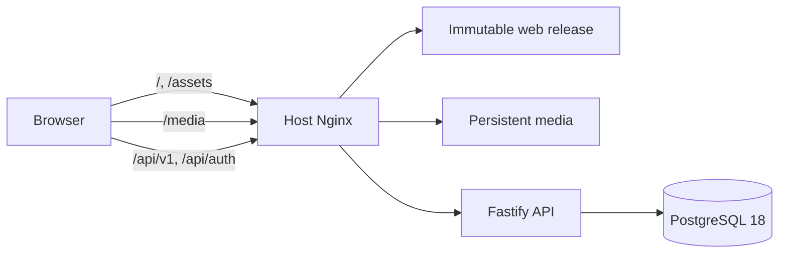

# Архитектура серверной версии

Репозиторий является npm workspace-монорепозиторием:

- `apps/web` — React/Vite, TanStack Query, TanStack Router, общий game shell и два контроллера исполнения (server/local);
- `apps/api` — stateless Fastify modular monolith;
- `packages/contracts` — TypeBox runtime-схемы и выведенные API-типы;
- `packages/game-core` — детерминированные правила pool/daily/compare/search/economy;
- `packages/database` — Drizzle schema, migration и postgres.js client;
- `packages/config` — fail-fast startup configuration;
- `scripts/content` — import/export/activate/materialize/media migration;
- `infra` — Docker, Nginx, backup и systemd templates.

## Инварианты

- Незавершённый API payload не содержит answer ID, seed или закрытые подсказки.
- Все mutation используют UUID `Idempotency-Key`; уникальные DB constraints закрывают retries/concurrency.
- Daily date вычисляется в `Europe/Moscow` на сервере.
- Challenge закреплён за content revision и answer item version.
- Wallet меняется только транзакцией с append-only ledger.
- Web runtime не загружает `items.json`, `search-index.json` или `daily-config.json`.
- Yandex mode включается только `vite --mode yandex`, использует hash-history и локальный контроллер поверх общего game core.
- Единственный перечень режимов, порядок дня и capabilities находятся в `packages/contracts/src/game-modes.ts`.
- Hosted-сборка не публикует ни `/data`, ни исторический `/city-content`; поиск и ответы идут через API.

## Маршруты и игровой поток

Player-приложение использует стабильные URL: `/games/:mode` для настройки, `/sessions/:sessionId` для серверной сессии, `/play/:mode` для автономной сессии, `/archive` и `/profile` для постоянных разделов. Browser history используется на hosted SPA, hash-history — в ZIP Яндекс Игр.

Локальный и серверный контроллеры приводят состояние к `GameControllerSnapshot` и рендерятся через `GamePageFrame`. Сравнение, фильтрация pool, daily seed и mode rules находятся в `packages/game-core`; React-представление режимов — в исчерпывающем `MODE_PRESENTATION`.

## Модули API

Auth отвечает за Better Auth и anonymous accounts; content — поиск и public cards; games — challenge/session/attempt/hints; stats — completion/streak/full-house/reward; economy — wallet/unlocks/free-play/promo; users — profile и legacy import; admin — revisions/settings/promos/wallet/review; health — liveness/readiness/meta.
