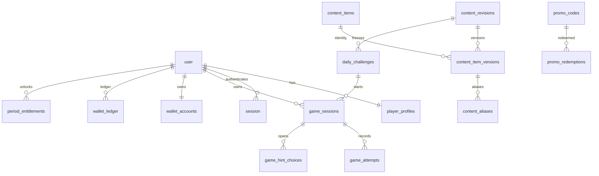

# База данных

Источник схемы: `packages/database/src/schema.ts`. Первая forward-only migration находится в `packages/database/migrations`. Она включает `pg_trgm`, 28 таблиц, auth schema Better Auth, доменные ограничения и trigger, запрещающий UPDATE/DELETE `wallet_ledger`.

Ключевые constraints: unique challenge variant; one user session per challenge; unique attempt position/guess/idempotency; maximum attempts check 0–10; unique operation key in ledger; non-negative wallet; one entitlement per mode/period; promo per-user numbering and request idempotency.

## Migration policy

Production changes только expand/contract. `npm run db:generate` создаёт SQL, `npm run db:migrate` применяет его, `npm run db:check` проверяет DB и active revision. Автоматический production down запрещён.
