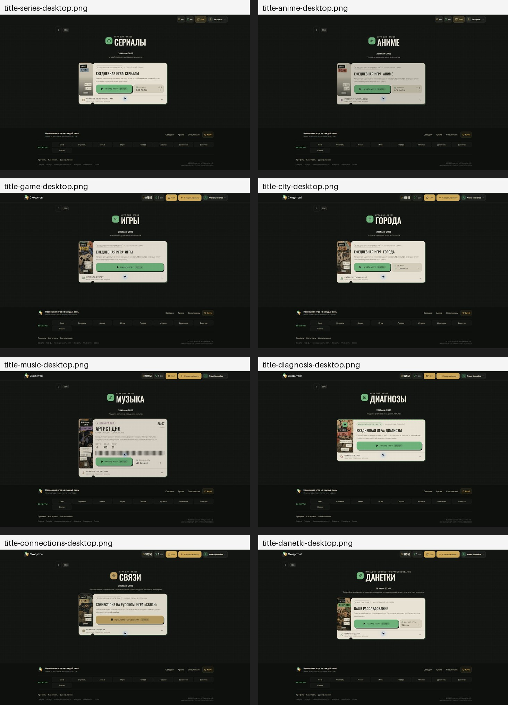
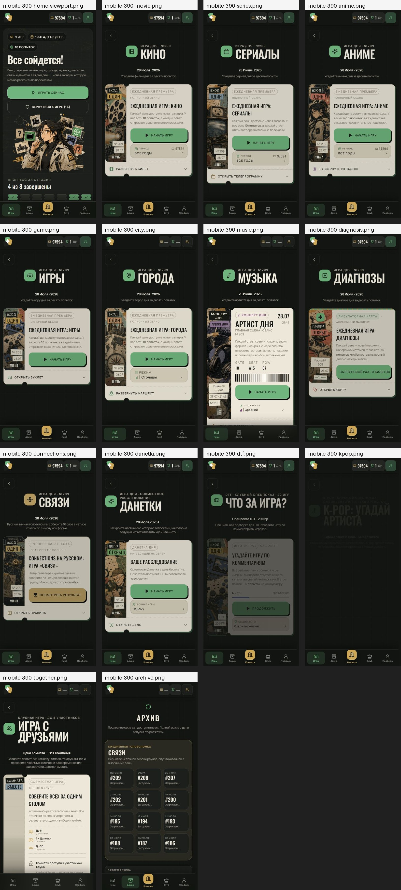
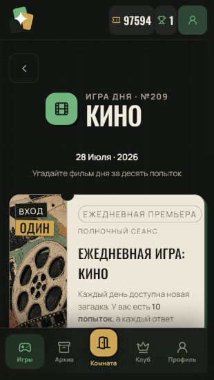
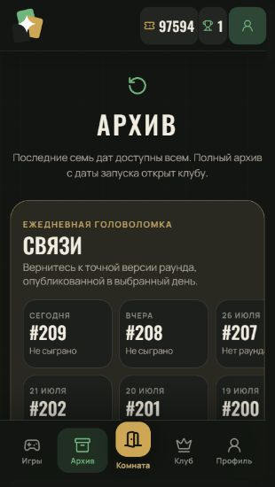
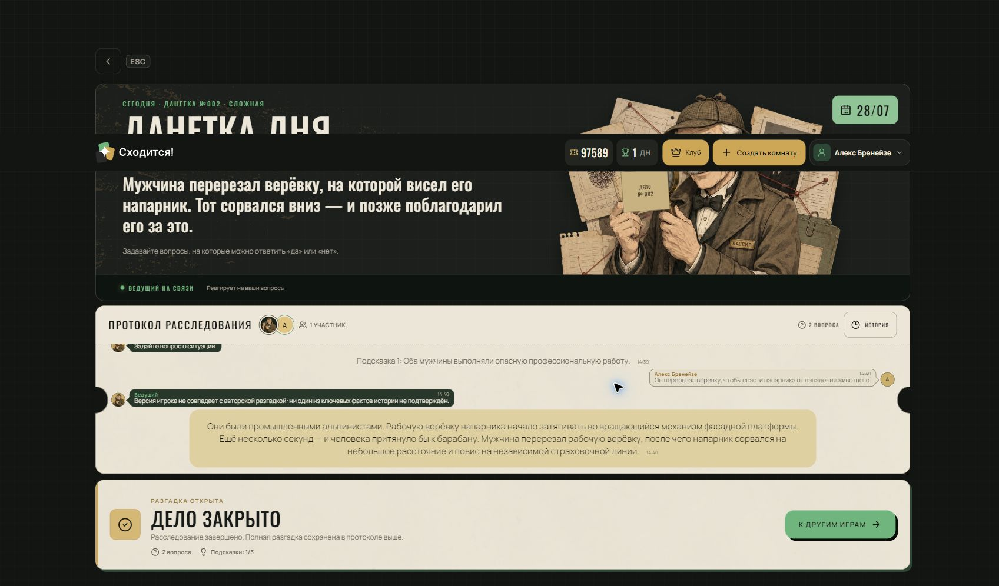
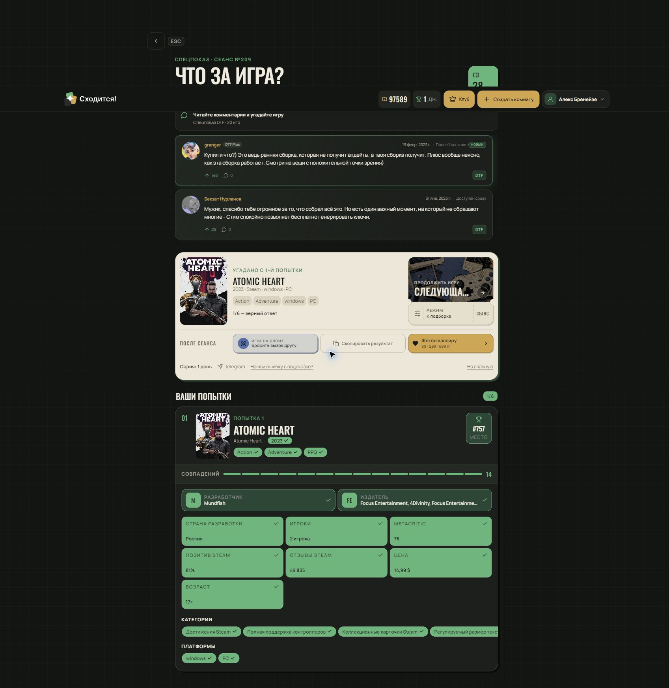

# Полный QA-аудит игр «Сходится!»

**Дата:** 28 июля 2026

**Среда:** production, Google Chrome

**Охват:** механика, логика, тексты, UI/UX, адаптивность, одиночные и совместные сценарии

> **Итог исходного аудита:** 57 находок — 3 критических, 18 высоких, 30 средних и 6 низких.
>
> **Статус на 28 июля 2026:** все 57 дефектов исправлены в коде. Во время повторной приёмки дополнительно найден и сразу закрыт один текстовый дефект R-01.

## Содержание

- [Краткое резюме](#краткое-резюме)
- [Статус исправления](#статус-исправления)
- [Покрытие и методика](#покрытие-и-методика)
- [Приоритетный список](#приоритетный-список)
- [Полный реестр дефектов](#полный-реестр-дефектов)
- [Сквозные продуктовые выводы](#сквозные-продуктовые-выводы)
- [Визуальные свидетельства](#визуальные-свидетельства)
- [Ограничения и повторная приёмка](#ограничения-и-повторная-приёмка)

## Краткое резюме

| Приоритет | Количество |
|---|---:|
| Критический | 3 |
| Высокий | 18 |
| Средний | 30 |
| Низкий | 6 |
| **Всего** | **57** |

## Статус исправления

| Группа | Закрытые ID | Статус |
|---|---|---|
| Критические | C-01—C-03 | ✅ Исправлены |
| Высокие | H-02—H-19 | ✅ Исправлены |
| Средние | M-01—M-30 | ✅ Исправлены |
| Низкие | L-01—L-06 | ✅ Исправлены |
| Повторная приёмка | R-01 | ✅ Найден и исправлен |

### Что изменено

- Разделены личная и комнатная сессии «Данеток»; исправлены запуск, presence, reveal, сдача, награда, повторная комната и состояния ожидания.
- Из API и UI архива исключены спойлеры незавершённых сессий; исправлены статусы Connections и порядок выбора режима.
- Приведены к одной модели попытки, дневной прогресс, периоды, финальный выбор, результаты, награды и тексты действий.
- Нормализованы showrunner/creator, Minecraft, DTF, жанры, страны, платформы и пользовательские подписи.
- Исправлены мобильные сетки, safe-area, нижняя навигация, горизонтальные ленты, touch targets, disabled states и доступность раскрывающихся блоков.
- Локализованы технические и англоязычные подписи; уточнены тексты «Музыки», «Диагнозов», «Связей», «Данеток» и совместной комнаты.
- Контракт режимов синхронизирован с фактическим наличием «Данеток», а маршруты и SEO покрыты тестами.

### Проверка исправлений

- `npm test` — 71 файл, 356 тестов.
- `npm run lint` — проверки UI/app-shell и TypeScript без ошибок.
- `npm run build` — production-сборка и генерация индексируемых страниц без ошибок.
- `git diff --check` — ошибок пробелов нет.
- Chrome: desktop, 320×568, 390×844 и 667×375; проверены главная, каталожные игры, «Музыка», «Диагнозы», «Связи», «Данетки», архив и совместная витрина.
- На 320/390/667 px не обнаружено глобального горизонтального overflow; архив на мобильном отображается двухколоночной сеткой, нижняя навигация имеет safe-area.

### R-01 · Неверное согласование в пустом состоянии «Городов»

- **Фактически при ретесте:** «Начните с любой города».
- **Исправлено:** «Начните с любого города».
- **Проверка:** подтверждено повторно в Chrome на активном игровом экране шириной 320 px.

### Исходный порядок исправления

1. Запуск совместной «Данетки» с двумя участниками.
2. Сокрытие ответа и постера в незавершённых архивных сессиях — включая API payload.
3. Атомарность платного доступа: подтверждение, списание, entitlement и отдельный админ-bypass.
4. Синхронизация дневного прогресса и статусов сессии между главной, результатом и архивом.
5. Presence/повторная игра/опасные действия в совместной комнате.
6. Нормализация контентных данных: showrunner, игры, DTF, жанры и страны.

## Покрытие и методика

Тестирование выполнено вручную в Chrome на production. Для совместных сценариев использованы две авторизованные учётные записи: администратор и обычный второй пользователь. Пароли и персональные данные в отчёт не включены.

| Объект | Проверенные ветки | Статус |
|---|---|---|
| Кино | Title, обычный/платный период, autocomplete, 10 ошибок, финальный выбор, результат | Пройдено |
| Сериалы | Title, квиз-подсказки, правильный ответ, данные шоураннера | Пройдено |
| Аниме | Title, поиск, совместный квиз | Пройдено |
| Игры | Title, Minecraft, совместный квиз, платформы/жанры | Пройдено |
| Города | Столицы+/Все, попытка, рейтинг, desktop/mobile/landscape | Пройдено |
| Музыка | Сложности, поиск артистов, завершённость, совместный квиз | Пройдено |
| Диагноз | Победа, награда, share, жалоба, совместный квиз | Пройдено |
| Connections | Ошибочный ход, четыре группы, результат, архив | Пройдено |
| Данетки | Соло-вопросы, финальная версия, сдача; co-op 2 пользователя | Исходно заблокирован; исправлено |
| DTF special | Title, попытка, Atomic Heart, share, mobile | Пройдено |
| K-pop special | Title, BTS, права гостя, mobile | Пройдено |
| Вместе · Квиз | 2 аккаунта; 7 паков; 3 и 9 раундов; чат; countdown; финал | Пройдено |
| Архив | Состояния, спойлеры, Connections, 320/360/390/667 px | Пройдено |

### Разрешения и ориентации

- Desktop: широкое окно Chrome; title, gameplay и result-состояния.
- Mobile portrait: 320, 360 и 390 CSS px.
- Mobile landscape: 667×375 CSS px.
- Проверялись клики, autocomplete, disabled/loading, таймеры, share, архив, чат и presence.

### Совместные сценарии

- **K3YUW:** 2 пользователя, 3 раунда, 45 секунд, чат, досрочный reveal, финал.
- **JL5QY:** все 7 паков, 9 раундов, Клуб-пауза после 6-го раунда.
- Пакеты: Сериалы, Кино, Аниме, Игры, Города, Музыка, Диагноз.
- **G65VF:** co-op «Данетки», 2/4 участника; старт воспроизводимо заблокирован.

### Технические наблюдения

- Ошибок первой стороны `shoditsa.ru` в браузерной консоли не зафиксировано.
- Ошибки wallet-extension `chrome-extension://…` исключены как внешние к приложению.
- Поведение платного периода отмечено отдельно, потому что проверялось под админ-ролью.

## Приоритетный список

| ID | Приоритет | Проблема | Основной владелец |
|---|---|---|---|
| C-01 | Критический | Совместная «Данетка» не запускается при двух подключённых игроках | Backend / Frontend |
| C-02 | Критический | Архив раскрывает ответы у незавершённых прошлых игр | Backend / Product |
| C-03 | Критический | Платный период запускается без подтверждения и видимого списания билетов | Backend / Product |
| H-02 | Высокий | Счётчик попыток одновременно показывает разные значения | Product / Frontend |
| H-03 | Высокий | На финальный выбор после десяти ошибок даётся около 10 секунд | Product / Accessibility |
| H-04 | Высокий | Снимок дневного прогресса на экране результата остаётся устаревшим | Backend / Frontend |
| H-05 | Высокий | Архив помечает завершённый сегодня Connections как «Не сыграно» | Backend / Frontend |
| H-06 | Высокий | AI даёт логически неверный категоричный ответ на релевантный вопрос | AI / Content |
| H-07 | Высокий | Мгновенная сдача приносит +10 билетов | Backend / Product |
| H-08 | Высокий | Тексты оплаты совместной «Данетки» противоречат друг другу | Product / Frontend |
| H-09 | Высокий | Хост может мгновенно завершить раунд для всех без подтверждения | Product / Frontend |
| H-10 | Высокий | «Настроить новую игру» создаёт новую комнату и теряет участников | Product / Backend |
| H-11 | Высокий | Вышедший пользователь продолжает отображаться «Подключён» | Backend |
| H-12 | Высокий | Поле «Шоураннер» заполнено авторами, актёрами и смешанными сущностями | Content / Data |
| H-13 | Высокий | Карточка Minecraft содержит недостоверные и неполные данные | Data / Content |
| H-14 | Высокий | Шкала рейтинга визуально трактует худшее место как лучшее | Product / Data |
| H-15 | Высокий | В карточке DTF видны ошибки импорта и дубликаты | Data / Content |
| H-16 | Высокий | Шеринг DTF смешивает количество попыток и количество полей сравнения | Product / Frontend |
| H-17 | Высокий | Гость видит внутренние QA-спецрежимы, включая закрытый K-pop | Backend / Product |
| H-18 | Высокий | Основные экраны клипуются на ширине 320 px | Frontend / Design |
| H-19 | Высокий | Главная показывает 9 игр, но прогресс считает только 8 без объяснения | Product / Backend |

## Полный реестр дефектов

### Критический приоритет — 3

#### C-01 · Совместная «Данетка» не запускается при двух подключённых игроках

- **Область:** Совместная игра · Данетки
- **Владелец:** Backend / Frontend
- **Как повторить:** Создать комнату G65VF, выбрать «Данетки», подключить второго пользователя (2/4), дважды нажать «Начать расследование».
- **Фактически:** Появляется alert: «Участников можно синхронизировать только с совместной игрой». Раунд не стартует, хотя пользователь уже находится в совместной комнате.
- **Ожидается:** При двух подключённых игроках расследование запускается и синхронно открывается обоим участникам.
- **Рекомендация:** Проверить определение типа комнаты и ветку синхронизации участников до старта. Добавить интеграционный тест: host + guest → Danetki → start.
- **Доказательство:** `Комната G65VF; повторено дважды в одной сессии.`

#### C-02 · Архив раскрывает ответы у незавершённых прошлых игр

- **Область:** Архив · Игровая честность
- **Владелец:** Backend / Product
- **Как повторить:** Открыть «Архив» и просмотреть карточки прошлых сессий со статусом «В процессе».
- **Фактически:** На карточке уже показаны постер и название целевого ответа, например «Под кайфом и в смятении», «Молчание ягнят» и другие.
- **Ожидается:** До завершения или окончательного отказа архив не раскрывает ответ; карточка позволяет продолжить игру без спойлера.
- **Рекомендация:** Разделить данные превью завершённой и активной сессии; не отдавать answer/poster клиенту для незавершённых записей.
- **Доказательство:** `mobile-320-archive.png; mobile-390-archive-settled.png`

#### C-03 · Платный период запускается без подтверждения и видимого списания билетов

- **Область:** Экономика · Доступ к периодам
- **Владелец:** Backend / Product
- **Как повторить:** Под админ-аккаунтом открыть «Кино», выбрать помеченный «Открыть · 120» период «С 2010 года», начать игру и вернуться в меню.
- **Фактически:** Сессия 2010-х создаётся без подтверждения, баланс остаётся 97594, а после возврата период по-прежнему помечен заблокированным и платным.
- **Ожидается:** Либо показывается и применяется явный админ-bypass, либо доступ покупается атомарно: подтверждение → списание → устойчивый статус «открыт».
- **Рекомендация:** Проверить ACL и транзакцию покупки на обычном аккаунте. Для админа вывести маркировку bypass и не смешивать её с пользовательским состоянием.
- **Доказательство:** `01-movie-title-desktop.png; поведение проверено под ролью администратора.`

### Высокий приоритет — 18

#### H-02 · Счётчик попыток одновременно показывает разные значения

- **Область:** Каталожные игры · Попытки
- **Владелец:** Product / Frontend
- **Как повторить:** Начать каталожную игру и сравнить верхний счётчик, aria-текст и блок «Ваши попытки» до и после первого ответа.
- **Фактически:** До ответа видно «Попытка 1 из 10» и aria «0 из 10»; после ответа — «2 из 10» и «Ваши попытки 1/10».
- **Ожидается:** Одна понятная модель: «Текущая попытка 2/10» отдельно от «Использовано 1/10», без противоречия в aria.
- **Рекомендация:** Ввести единый источник данных и разные подписи для currentAttempt и attemptsUsed.
- **Доказательство:** `02-movie-after-attempt-desktop.png`

#### H-03 · На финальный выбор после десяти ошибок даётся около 10 секунд

- **Область:** Кино · Финальный выбор
- **Владелец:** Product / Accessibility
- **Как повторить:** Израсходовать 10 попыток в «Кино» и дождаться экрана с четырьмя подробными карточками.
- **Фактически:** Таймер почти сразу показывает несколько секунд и автоматически раскрывает ответ; прочитать и сравнить четыре карточки трудно.
- **Ожидается:** Пользователь получает достаточно времени или подтверждает выбор без жёсткого автозавершения.
- **Рекомендация:** Увеличить таймер минимум до 30–45 секунд, приостановить его для reduced-motion/assistive-сценариев или убрать автосабмит.
- **Доказательство:** `movie-after-10-attempts-desktop.png`

#### H-04 · Снимок дневного прогресса на экране результата остаётся устаревшим

- **Область:** Прогресс · Результаты
- **Владелец:** Backend / Frontend
- **Как повторить:** Завершить несколько игр, открыть более ранний результат и сравнить «Сегодня» с главной страницей.
- **Фактически:** Результат «Диагноза» показывал 2/8, позже главная — 3/8; результат проигранного «Кино» остался на 3/8, когда главная после обновления показывала 4/8.
- **Ожидается:** Общий дневной прогресс обновляется после каждой завершённой сессии на всех экранах.
- **Рекомендация:** Инвалидировать progress query/cache после finish/surrender/timeout и получать агрегат с сервера.
- **Доказательство:** `diagnosis-win-desktop.png; mobile-390-state-movie-result-settled.png`

#### H-05 · Архив помечает завершённый сегодня Connections как «Не сыграно»

- **Область:** Архив · Connections
- **Владелец:** Backend / Frontend
- **Как повторить:** Завершить Connections и открыть архив в тот же день.
- **Фактически:** В архивном блоке Connections остаётся статус «Не сыграно», хотя результат и история попыток доступны.
- **Ожидается:** Статус и результат соответствуют завершённой сессии.
- **Рекомендация:** Сверить ключ даты/таймзону и идентификатор режима в агрегаторе архива.
- **Доказательство:** `connections-result-desktop.png; mobile-390-archive-settled.png`

#### H-06 · AI даёт логически неверный категоричный ответ на релевантный вопрос

- **Область:** Данетки · AI-логика
- **Владелец:** AI / Content
- **Как повторить:** В загадке про мойщиков фасада спросить: «Это произошло во время альпинистского восхождения?» и затем открыть разгадку.
- **Фактически:** AI отвечает «Нет», а финал объясняет, что герои — промышленные альпинисты на фасадной платформе.
- **Ожидается:** Ответ уточняет различие: «Не во время спортивного восхождения, но работа связана с промышленным альпинизмом».
- **Рекомендация:** Передавать модели ключевые факты и правила неполной истинности; добавить контентный тест на противоречие answer ↔ solution.
- **Доказательство:** `danetki-surrender-result-desktop.png`

#### H-07 · Мгновенная сдача приносит +10 билетов

- **Область:** Данетки · Экономика
- **Владелец:** Backend / Product
- **Как повторить:** Начать бесплатную ежедневную «Данетку» и сразу нажать «Сдаться», не задавая вопросов.
- **Фактически:** Баланс вырос с 97579 до 97589; экран результата не подчёркивает, что это сдача.
- **Ожидается:** Сдача не создаёт положительный фарм-цикл либо награда явно зависит от участия/разгадки.
- **Рекомендация:** Проверить формулу награды и ограничить reward при surrender без прогресса.
- **Доказательство:** `danetki-surrender-result-desktop.png`

#### H-08 · Тексты оплаты совместной «Данетки» противоречат друг другу

- **Область:** Совместная игра · Оплата
- **Владелец:** Product / Frontend
- **Как повторить:** В комнате выбрать «Данетки» и сравнить карточку запуска у хоста и гостя.
- **Фактически:** Хост одновременно видит «Без доплаты» и «Спишутся с вас при запуске» без суммы; гость — «Без доплаты · Алекс Бренейзе оплатит при запуске».
- **Ожидается:** Однозначно указаны плательщик, сумма и момент списания; «без доплаты» не соседствует с обещанием списания.
- **Рекомендация:** Собрать единую pricing-модель на сервере и отрисовывать одну согласованную фразу для каждой роли.
- **Доказательство:** `Комната G65VF, роли host и guest.`

#### H-09 · Хост может мгновенно завершить раунд для всех без подтверждения

- **Область:** Совместный квиз · Управление раундом
- **Владелец:** Product / Frontend
- **Как повторить:** Во время активного квиз-раунда нажать у хоста «Показать результаты» при оставшихся ~40 секундах.
- **Фактически:** Раунд немедленно заканчивается у обоих игроков, ответы фиксируются как отсутствующие/нулевые.
- **Ожидается:** Опасное действие либо недоступно до ответов всех игроков, либо требует подтверждения и объясняет последствия.
- **Рекомендация:** Переименовать в «Завершить раунд для всех» и добавить confirm с числом неответивших.
- **Доказательство:** `Комната K3YUW, раунд 3.`

#### H-10 · «Настроить новую игру» создаёт новую комнату и теряет участников

- **Область:** Совместный квиз · Повторная игра
- **Владелец:** Product / Backend
- **Как повторить:** Закончить квиз в комнате K3YUW и нажать «Настроить новую игру».
- **Фактически:** Создаётся комната G65VF с новым кодом, второй пользователь и чат не переносятся.
- **Ожидается:** По формулировке пользователь ожидает новый матч в той же комнате и с тем же составом.
- **Рекомендация:** Либо переиспользовать roomId, либо назвать действие «Создать новую комнату» и предупредить о разрыве группы.
- **Доказательство:** `together-quiz-final-desktop.png`

#### H-11 · Вышедший пользователь продолжает отображаться «Подключён»

- **Область:** Совместная игра · Presence
- **Владелец:** Backend
- **Как повторить:** Подключить второго пользователя к комнате, затем выйти из аккаунта и проверить список участников у хоста.
- **Фактически:** Оба профиля продолжают числиться подключёнными, хотя активна только одна сессия.
- **Ожидается:** Presence истекает после logout/disconnect/heartbeat timeout.
- **Рекомендация:** Инвалидировать сокет и presence на logout; добавить TTL и серверную проверку перед стартом.
- **Доказательство:** `Комнаты K3YUW и G65VF.`

#### H-12 · Поле «Шоураннер» заполнено авторами, актёрами и смешанными сущностями

- **Область:** Совместный квиз · Сериалы
- **Владелец:** Content / Data
- **Как повторить:** Играть пак «Сериалы» в совместном квизе и открыть подсказки/ответы нескольких раундов.
- **Фактически:** Для советского «Миража» указан Джеймс Хэдли Чейз; для «Лютера» — Нил Кросс и Идрис Эльба; для What We Do in the Shadows — смешанный список с Jake Bender.
- **Ожидается:** Поле содержит реального шоураннера/создателя, либо называется «Создатели / авторы» и нормализовано по языку.
- **Рекомендация:** Исправить mapping источника и провести миграционную проверку значений по типу person_role.
- **Доказательство:** `Комнаты K3YUW и JL5QY.`

#### H-13 · Карточка Minecraft содержит недостоверные и неполные данные

- **Область:** Игры · Каталог
- **Владелец:** Data / Content
- **Как повторить:** В «Играх» выбрать Minecraft и открыть результат сравнения.
- **Фактически:** Показано «Minecraft 2011 · Android», жанр Fighting, «5 игроков», нет ключевых платформ и данных Steam.
- **Ожидается:** Нормализованная каноническая запись с корректными платформами, жанрами и multiplayer-данными.
- **Рекомендация:** Дедуплицировать сущности по canonical game id и ввести валидацию платформ/жанров/числа игроков.
- **Доказательство:** `game-minecraft-attempt-desktop.png`

#### H-14 · Шкала рейтинга визуально трактует худшее место как лучшее

- **Область:** Города · Рейтинг
- **Владелец:** Product / Data
- **Как повторить:** Сделать попытку в «Городах» и прочитать легенду и длины шкал.
- **Фактически:** Легенда говорит «Длиннее шкала — выше место в рейтинге», тогда как большее числовое место обычно означает худший результат; подписи ещё и обрезаны.
- **Ожидается:** Направление шкалы и текст однозначно объясняют, означает ли длина больший показатель или лучшее место.
- **Рекомендация:** Инвертировать нормализацию для rank или заменить на числовое место с пояснением «1 — лучшее».
- **Доказательство:** `city-moscow-attempt-desktop.png`

#### H-15 · В карточке DTF видны ошибки импорта и дубликаты

- **Область:** Специгра DTF · Данные
- **Владелец:** Data / Content
- **Как повторить:** Открыть результат Atomic Heart в DTF-специгре.
- **Фактически:** Автор комментария — «Неподходящая длина или формат»; издатели Focus Entertainment и 4Divinity повторены; Windows и PC продублированы; интерфейс смешивает русский и английский.
- **Ожидается:** Валидные автор, издатели и нормализованные платформы без повторов и placeholder-ошибок.
- **Рекомендация:** Добавить schema validation, unique-нормализацию и quarantine записей с parser error.
- **Доказательство:** `dtf-atomic-heart-result-desktop.png`

#### H-16 · Шеринг DTF смешивает количество попыток и количество полей сравнения

- **Область:** Специгра DTF · Поделиться
- **Владелец:** Product / Frontend
- **Как повторить:** Завершить DTF-игру и открыть текст «Поделиться».
- **Фактически:** Текст показывает «🎮 1/6», затем 14 зелёных квадратов, сырую дату и «Все годы»; называется просто «Игра дня».
- **Ожидается:** Сетка и счётчик измеряют одну сущность, а спецрежим узнаваем по названию.
- **Рекомендация:** Согласовать share schema: attempts/limit отдельно, comparison fields отдельно; локализовать дату и бренд режима.
- **Доказательство:** `dtf-atomic-heart-result-desktop.png`

#### H-17 · Гость видит внутренние QA-спецрежимы, включая закрытый K-pop

- **Область:** Доступ · Спецрежимы
- **Владелец:** Backend / Product
- **Как повторить:** Выйти из аккаунта и открыть главную страницу.
- **Фактически:** Гостю доступны карточки DTF и K-pop с маркером «QA-доступ»; K-pop при этом описан как закрытая версия.
- **Ожидается:** Внутренние/админские режимы скрыты и защищены серверным ACL либо явно публичны без внутренней маркировки.
- **Рекомендация:** Проверить entitlement на выдаче списка игр и на самом route/API, не ограничиваться скрытием карточки.
- **Доказательство:** `00-home-desktop.png; title-pages-desktop-contact-sheet.jpg`

#### H-18 · Основные экраны клипуются на ширине 320 px

- **Область:** Адаптивность · 320 px
- **Владелец:** Frontend / Design
- **Как повторить:** Открыть главную, «Кино», «Города» и архив при viewport 320 px.
- **Фактически:** В «Кино» карточка билетов шире viewport; в архиве обрезается третий столбец; в «Городах» и шапке обрываются тексты.
- **Ожидается:** Контент помещается без потери смысла и без скрытых недоступных элементов на минимальной поддерживаемой ширине.
- **Рекомендация:** Убрать min-width у карточек/гридов, включить перенос подписей и проверить 320 px как отдельный breakpoint.
- **Доказательство:** `mobile-320-movie-settled.png; mobile-320-archive.png; mobile-320-city-attempt.png`

#### H-19 · Главная показывает 9 игр, но прогресс считает только 8 без объяснения

- **Область:** Главная · Дневной прогресс
- **Владелец:** Product / Backend
- **Как повторить:** Открыть главную и сравнить «9 игр», список карточек и «4 из 8 завершены».
- **Фактически:** «Данетки» исключены из знаменателя, но пользователь не видит правила исключения; проигрыш в другой игре учитывается с задержкой.
- **Ожидается:** Состав дневного зачёта прозрачен, а завершение учитывается консистентно.
- **Рекомендация:** Показать «8 зачётных игр + Данетки вне серии» и унифицировать событие completion.
- **Доказательство:** `00-home-desktop.png; mobile-320-home-progress.png`

### Средний приоритет — 30

#### M-01 · Пользовательский интерфейс показывает внутренние и англоязычные маркеры

- **Область:** Спецрежимы · Копирайт
- **Владелец:** Content / Product
- **Как повторить:** Открыть DTF и K-pop спецстраницы.
- **Фактически:** Видны «QA-доступ» и «K-pop artist dossier» в русскоязычном интерфейсе.
- **Ожидается:** В продакшене нет внутренних статусов; описание локализовано и соответствует тону продукта.
- **Рекомендация:** Скрыть QA badge вне internal-сборки и заменить descriptor на русский.
- **Доказательство:** `mobile-390-kpop-settled.png; mobile-390-dtf-settled.png`

#### M-02 · Количество игр DTF указано тремя разными способами

- **Область:** Специгра DTF · Контент
- **Владелец:** Content
- **Как повторить:** Сравнить карточку на главной, описание и title page DTF.
- **Фактически:** Карточка говорит «25 ИГР», описание и титульный экран — 20; slug содержит 25-v1.
- **Ожидается:** Во всех точках показан один актуальный размер набора.
- **Рекомендация:** Хранить count в одном manifest и генерировать из него карточку, описание и заголовок.
- **Доказательство:** `00-home-desktop.png; mobile-390-dtf-settled.png`

#### M-03 · Hero-текст «1 загадка в день» противоречит набору из девяти игр

- **Область:** Главная · Обещание продукта
- **Владелец:** Product / Content
- **Как повторить:** Открыть главную и прочитать hero и список игр.
- **Фактически:** Страница обещает «1 загадка в день», одновременно предлагая девять ежедневных режимов.
- **Ожидается:** Формулировка отражает фактическую механику: новая загадка в каждой игре.
- **Рекомендация:** Заменить на «Новые загадки каждый день» или объяснить одну загадку на игру.
- **Доказательство:** `00-home-desktop.png`

#### M-04 · Статусы «Готово» перекрывают метаданные карточек

- **Область:** Главная · Desktop UI
- **Владелец:** Frontend / Design
- **Как повторить:** Завершить «Музыку» и Connections и посмотреть карточки на desktop.
- **Фактически:** Штампы «ГОТОВО 10/10» и «ГОТОВО» накладываются на «913 В ПУЛЕ» и «10 РАУНДОВ».
- **Ожидается:** Статус занимает выделенную область и не перекрывает данные.
- **Рекомендация:** Перевести badge в поток/отдельную строку или резервировать под него ширину.
- **Доказательство:** `00-home-desktop.png`

#### M-05 · Завершённую музыкальную сессию трудно найти и восстановить

- **Область:** Музыка · Завершённость
- **Владелец:** Product / Backend
- **Как повторить:** После завершения перейти на /games/music с главной.
- **Фактически:** Титульный экран снова предлагает «Начать игру» и не показывает, какая сложность уже сыграна или где открыть результат.
- **Ожидается:** Есть «Продолжить/Посмотреть результат» и явный статус по выбранной сложности.
- **Рекомендация:** Хранить и показывать active/completed session per difficulty; не создавать новую сессию неявно.
- **Доказательство:** `title-music-desktop.png; mobile-390-music.png`

#### M-06 · Доступность известных артистов меняется по сложности без понятного выхода

- **Область:** Музыка · Поиск артистов
- **Владелец:** Product / Data
- **Как повторить:** Искать Björk/Bjork, Madonna или Radiohead в разных сложностях.
- **Фактически:** Часть артистов отсутствует в hard/expert; сообщение советует «выберите другой режим» уже после старта, когда сменить режим нельзя.
- **Ожидается:** Пул режима объяснён до старта, а из пустого поиска можно безопасно сменить сложность.
- **Рекомендация:** Показывать покрытие пула на title page и добавить «Сменить сложность» без потери дневного состояния.
- **Доказательство:** `mobile-390-music.png`

#### M-07 · Жанры и страны выводятся необработанными кодами

- **Область:** Локализация · Музыка
- **Владелец:** Content / Data
- **Как повторить:** Открыть музыкальные подсказки в соло и совместном квизе.
- **Фактически:** Жанры показаны как dance-pop/edm, страна — «RU».
- **Ожидается:** Русские названия и нормализованная страна «Россия» при русской локали.
- **Рекомендация:** Добавить словари genre/country и fallback без сырых кодов.
- **Доказательство:** `Комната JL5QY, музыкальный раунд MORGENSHTERN.`

#### M-08 · В активной игре не видно выбранный пул городов

- **Область:** Города · Выбранный режим
- **Владелец:** Product / Frontend
- **Как повторить:** На title page выбрать «Столицы+» или «Все», начать игру.
- **Фактически:** В сессии нет подписи текущего режима, поэтому невозможно проверить активный пул; названия в селекторе ещё и сокращаются по-разному.
- **Ожидается:** Активный вариант виден в шапке/параметрах с единым названием.
- **Рекомендация:** Показывать mode badge и использовать одну строку для label во всех состояниях.
- **Доказательство:** `title-city-desktop.png; city-moscow-attempt-desktop.png`

#### M-09 · Share-текст диагноза содержит нерелевантный период и сырую дату

- **Область:** Диагноз · Поделиться
- **Владелец:** Frontend / Content
- **Как повторить:** Завершить «Диагноз» и открыть текст публикации.
- **Фактически:** Появляются «Все годы», ISO-дата и URL с period=all, хотя у режима нет выбора периода.
- **Ожидается:** Шеринг содержит только релевантные параметры и локализованную дату.
- **Рекомендация:** Сделать отдельный share template для Diagnosis.
- **Доказательство:** `diagnosis-win-desktop.png`

#### M-10 · Форма жалобы предлагает категории из Connections

- **Область:** Жалоба · Диагноз
- **Владелец:** Product / Frontend
- **Как повторить:** На экране результата «Диагноза» открыть форму жалобы.
- **Фактически:** В списке присутствуют причины, применимые только к группировке слов/Connections.
- **Ожидается:** Категории фильтруются по текущему типу игры.
- **Рекомендация:** Передавать gameMode в report form и использовать mode-specific taxonomy.
- **Доказательство:** `Результат Diagnosis.`

#### M-11 · Неверное склонение награды: «Получено +23 билетов»

- **Область:** Диагноз · Грамматика
- **Владелец:** Content
- **Как повторить:** Выиграть «Диагноз» и посмотреть блок награды.
- **Фактически:** Числительное 23 согласовано как «билетов».
- **Ожидается:** «Получено +23 билета».
- **Рекомендация:** Использовать общую функцию pluralization для билет/билета/билетов.
- **Доказательство:** `diagnosis-win-desktop.png`

#### M-12 · У медицинской игры нет заметного дисклеймера

- **Область:** Диагноз · Риск восприятия
- **Владелец:** Legal / Product
- **Как повторить:** Открыть title page и результат «Диагноза».
- **Фактически:** Интерфейс использует медицинские термины без пояснения, что это игра и не медицинская рекомендация.
- **Ожидается:** Рядом со стартом/результатом есть короткое ясное предупреждение.
- **Рекомендация:** Добавить «Игра не предназначена для самодиагностики»; согласовать формулировку с legal.
- **Доказательство:** `title-diagnosis-desktop.png; diagnosis-win-desktop.png`

#### M-13 · «История попыток · 4 хода» не учитывает ошибочный ход

- **Область:** Connections · История
- **Владелец:** Product / Frontend
- **Как повторить:** Сделать одну ошибочную отправку, затем собрать четыре группы.
- **Фактически:** Результат показывает «1 ошибка», но история содержит только четыре успешные группы и называет это четырьмя ходами.
- **Ожидается:** Либо история включает все пять отправок, либо называется «Найдено 4 группы».
- **Рекомендация:** Сохранять rejected submissions или изменить терминологию.
- **Доказательство:** `connections-result-desktop.png`

#### M-14 · Старт обещает выбрать готовый вопрос, но вопросов нет

- **Область:** Данетки · Онбординг
- **Владелец:** Product / Content
- **Как повторить:** Начать одиночную «Данетку».
- **Фактически:** Текст предлагает выбрать стартовый вопрос, однако на экране нет chips/вариантов вопросов.
- **Ожидается:** Либо варианты отображаются, либо инструкция предлагает написать вопрос вручную.
- **Рекомендация:** Восстановить starter prompts или обновить копирайт.
- **Доказательство:** `danetki-solo-start-desktop.png`

#### M-15 · На открытый вопрос AI отвечает тавтологией вместо обучения формату

- **Область:** Данетки · Обучение
- **Владелец:** AI / Product
- **Как повторить:** Спросить «Что именно произошло?».
- **Фактически:** Ответ: «Задайте вопрос о ситуации», без объяснения, что ожидается вопрос с ответом «да/нет/неважно».
- **Ожидается:** Система мягко переформулирует или приводит пример допустимого вопроса.
- **Рекомендация:** Добавить валидатор формата и обучающий fallback.
- **Доказательство:** `Одиночная Danetki-сессия.`

#### M-16 · Соло-диалоги говорят о «всех участниках комнаты»

- **Область:** Данетки · Соло-тексты
- **Владелец:** Content / Frontend
- **Как повторить:** В одиночной игре открыть подтверждение подсказки и финальной версии.
- **Фактически:** Тексты предупреждают, что действие увидят все участники комнаты.
- **Ожидается:** Для solo используются отдельные формулировки без несуществующих участников.
- **Рекомендация:** Разделить copy по sessionType.
- **Доказательство:** `Одиночная Danetki-сессия.`

#### M-17 · После сдачи результат не сообщает о сдаче и оставляет устаревшую инструкцию

- **Область:** Данетки · Результат
- **Владелец:** Product / Frontend
- **Как повторить:** Сдаться сразу после старта.
- **Фактически:** Экран выглядит как обычный результат, продолжает предлагать задавать вопросы, хотя контролы исчезли.
- **Ожидается:** Явный статус «Вы сдались», объяснение награды и следующий доступный шаг.
- **Рекомендация:** Добавить отдельный surrender state и убрать active-game copy.
- **Доказательство:** `danetki-surrender-result-desktop.png`

#### M-18 · Фидбек на неверную финальную версию звучит технически и роботизированно

- **Область:** Данетки · Обратная связь
- **Владелец:** AI / Content
- **Как повторить:** Отправить неверную финальную версию.
- **Фактически:** Текст вида «ни один из ключевых фактов…» воспринимается как внутренний критерий оценивания.
- **Ожидается:** Человеческое объяснение, какие части направления верны и чего не хватает, без раскрытия ответа.
- **Рекомендация:** Переписать шаблон и добавить tone-of-voice примеры.
- **Доказательство:** `Одиночная Danetki-сессия.`

#### M-19 · Кнопка старта пишет «3 раундов»

- **Область:** Совместный квиз · Грамматика
- **Владелец:** Content
- **Как повторить:** В комнате выбрать 3 раунда.
- **Фактически:** Неверное склонение числительного.
- **Ожидается:** «3 раунда».
- **Рекомендация:** Подключить общую pluralization-функцию.
- **Доказательство:** `Комната K3YUW.`

#### M-20 · Отправка чата переводит кнопку старта в «Запускаем…»

- **Область:** Совместная комната · Pending state
- **Владелец:** Frontend
- **Как повторить:** В лобби отправить сообщение в чат и наблюдать кнопку запуска.
- **Фактически:** Несвязанная кнопка временно блокируется и меняет подпись на «Запускаем…».
- **Ожидается:** Pending-состояние локально для отправляемого сообщения.
- **Рекомендация:** Разделить mutation state для chat, settings и start.
- **Доказательство:** `Комната K3YUW.`

#### M-21 · Выбор семи паков молча меняет число раундов с 6 на 9

- **Область:** Совместный квиз · Настройки
- **Владелец:** Product / Frontend
- **Как повторить:** Установить 6 раундов и отметить все 7 паков.
- **Фактически:** Количество автоматически становится 9 без уведомления; диапазон Клуба 3–30 не объясняет динамический минимум.
- **Ожидается:** Причина корректировки видна до применения или пользователь сам подтверждает новое значение.
- **Рекомендация:** Показать inline-сообщение «Для 7 паков минимум 9 раундов» и визуально подсветить изменённое поле.
- **Доказательство:** `Комната JL5QY.`

#### M-22 · Перед раундом одновременно показаны «Приготовьтесь» и таймер 00:00

- **Область:** Совместный квиз · Countdown
- **Владелец:** Frontend / Design
- **Как повторить:** Дождаться предраундового countdown.
- **Фактически:** Основной таймер раунда уже виден как 00:00, пока отдельный счётчик показывает 3…1.
- **Ожидается:** Таймер раунда скрыт/заморожен на полном времени до фактического старта.
- **Рекомендация:** Развести preRound и activeRound UI states.
- **Доказательство:** `Комнаты K3YUW и JL5QY.`

#### M-23 · Одиночная комната с нулём очков всё равно объявляет «Победителя»

- **Область:** Совместный квиз · Финал
- **Владелец:** Product / Content
- **Как повторить:** Завершить комнату без второго участника или без набранных очков.
- **Фактически:** Финальный экран использует соревновательный титул «Победитель».
- **Ожидается:** Для одного игрока — «Результат», для нескольких — победитель только при валидном сравнении.
- **Рекомендация:** Выбирать заголовок по participantCount и score state.
- **Доказательство:** `mobile-390-state-together-final.png`

#### M-24 · Счёт обновляется до показа общего результата

- **Область:** Совместный квиз · Счёт
- **Владелец:** Product / Frontend
- **Как повторить:** Одному игроку ответить, пока второй ещё выбирает.
- **Фактически:** Очки хоста увеличились до reveal, что косвенно раскрывает правильность ответа.
- **Ожидается:** Счёт фиксируется и показывается после блокировки ответов/общего reveal.
- **Рекомендация:** Не публиковать delta score в live presence до завершения фазы ответа.
- **Доказательство:** `Комната K3YUW, раунд 2.`

#### M-25 · Результат использует общий тип «Группа или дуэт» для обычной группы

- **Область:** K-pop · Терминология
- **Владелец:** Content
- **Как повторить:** Выбрать BTS и открыть сравнение.
- **Фактически:** Поле типа не соответствует конкретной сущности и звучит как поисковая категория.
- **Ожидается:** Конкретное значение «Группа» или нейтральный label «Тип исполнителя».
- **Рекомендация:** Разделить label поля и значение enum.
- **Доказательство:** `kpop-bts-attempt-desktop.png`

#### M-26 · Название Connections смешивает английский и русский

- **Область:** Локализация · Заголовки
- **Владелец:** Content / Design
- **Как повторить:** Открыть результат Connections.
- **Фактически:** Заголовок «CONNECTIONS НА РУССКОМ» выбивается из остального русского интерфейса.
- **Ожидается:** Единая локализованная система названий или последовательный бренд.
- **Рекомендация:** Зафиксировать бренд-гайд: «Связи» либо Connections с русским пояснением в подзаголовке.
- **Доказательство:** `connections-result-desktop.png`

#### M-27 · Большой блок Connections отодвигает фильтры других игр

- **Область:** Архив · Навигация
- **Владелец:** Product / Design
- **Как повторить:** Открыть архив на мобильном.
- **Фактически:** Сначала показан длинный самостоятельный блок Connections, а вкладки категорий находятся ниже; на 320 px сетка дополнительно клипуется.
- **Ожидается:** Фильтры и структура архива доступны сразу и единообразно для всех режимов.
- **Рекомендация:** Включить Connections в общую модель фильтров или свернуть блок по умолчанию.
- **Доказательство:** `mobile-390-archive-settled.png; mobile-320-archive.png`

#### M-28 · Комментарий создаёт вложенный вертикальный скролл

- **Область:** DTF · Mobile UI
- **Владелец:** Frontend / Design
- **Как повторить:** Открыть DTF-результат на 390 px и прокручивать длинный комментарий.
- **Фактически:** У карточки комментария собственный scrollbar внутри общего скролла страницы.
- **Ожидается:** Один предсказуемый вертикальный поток либо явно раскрываемый текст.
- **Рекомендация:** Убрать фиксированную высоту на мобильном или использовать «Показать полностью».
- **Доказательство:** `mobile-390-state-dtf-result-settled.png`

#### M-29 · Подписи метрик обрезаются даже на desktop

- **Область:** Города · Desktop UI
- **Владелец:** Design / Frontend
- **Как повторить:** Сделать попытку в «Городах» на широком экране.
- **Фактически:** Видны сокращения «ЧЕЛОВЕЧЕСКИЙ …», «КАЧЕСТВО ЖИЗ…» при наличии свободного пространства.
- **Ожидается:** Полные или общепринятые краткие названия без многоточия.
- **Рекомендация:** Пересмотреть ширины колонок и typography; переносить label на две строки.
- **Доказательство:** `city-moscow-attempt-desktop.png`

#### M-30 · При переходах до нескольких секунд видны затемнение и пустой баланс

- **Область:** Загрузка · UX
- **Владелец:** Frontend / Performance
- **Как повторить:** Переходить между главной, архивом и играми на холодном/обновлённом route.
- **Фактически:** В течение примерно 0,6–1,8 с встречается dim overlay и «—» вместо билетов; полное settled-состояние иногда наступает через 2,4–3,8 с.
- **Ожидается:** Скелетон не выглядит как блокировка/ошибка, сохранён последний известный баланс, интерактивность восстанавливается быстро.
- **Рекомендация:** Профилировать waterfall, кэшировать профиль и заменить глобальный overlay локальными skeleton-состояниями.
- **Доказательство:** `mobile-390-state-movie-result.png → mobile-390-state-movie-result-settled.png`

### Низкий приоритет — 6

#### L-01 · Раскрывающиеся строки реализованы как generic, а не кнопки

- **Область:** Доступность · Семантика
- **Владелец:** Frontend
- **Как повторить:** Проверить accessibility tree у «Как играть» и аккордеонов результата.
- **Фактически:** Визуально кликабельные заголовки имеют generic role; мышью работают, клавиатурная семантика неочевидна.
- **Ожидается:** button с aria-expanded/aria-controls и доступным фокусом.
- **Рекомендация:** Использовать нативный button или details/summary.
- **Доказательство:** `Title pages и result screens.`

#### L-02 · Часть мобильных целей меньше рекомендуемых 44×44 px

- **Область:** Доступность · Touch targets
- **Владелец:** Design / Frontend
- **Как повторить:** Измерить нижнюю навигацию и верхний логотип на 390 px.
- **Фактически:** Высота ряда целей около 34–36 px.
- **Ожидается:** Интерактивная область не менее 44×44 CSS px либо эквивалентный padding.
- **Рекомендация:** Увеличить hit area без обязательного увеличения видимой иконки.
- **Доказательство:** `mobile-390-home-viewport.png`

#### L-03 · Disabled-кнопка отправки выглядит ярко активной

- **Область:** Доступность · Disabled state
- **Владелец:** Design / Frontend
- **Как повторить:** Открыть мобильную каталожную игру с пустым/невыбранным ответом.
- **Фактически:** Зелёная стрелка визуально активна, хотя DOM-кнопка disabled.
- **Ожидается:** Disabled-состояние различимо цветом, контрастом и курсором; причина понятна.
- **Рекомендация:** Добавить disabled token и helper text до выбора результата поиска.
- **Доказательство:** `mobile-390-state-city-attempt.png`

#### L-04 · Фиксированная нижняя навигация перекрывает контент в landscape

- **Область:** Адаптивность · Landscape
- **Владелец:** Frontend / Design
- **Как повторить:** Открыть игру при 667×375 и прокрутить к нижней части состояния попытки.
- **Фактически:** Навигация частично накрывает прогресс/контролы, полезная высота резко уменьшается.
- **Ожидается:** Контент имеет safe-area padding и остаётся читаемым над фиксированной панелью.
- **Рекомендация:** Добавить bottom inset по реальной высоте nav и landscape-вариант компактной панели.
- **Доказательство:** `landscape-667-city.png; landscape-667-together.png`

#### L-05 · Часть горизонтально обрезанных карточек не выглядит как прокручиваемый список

- **Область:** Адаптивность · Карточки
- **Владелец:** Design
- **Как повторить:** Открыть главную/архив на 390 px и посмотреть край контейнера.
- **Фактически:** Документ не имеет глобального overflow, но часть соседнего контента скрывается без явной affordance прокрутки.
- **Ожидается:** Если это carousel, видны snap/peek/индикатор; если grid — элементы помещаются.
- **Рекомендация:** Добавить scroll-snap и визуальную подсказку либо перейти на одноколоночный layout.
- **Доказательство:** `mobile-390-home-viewport.png; mobile-390-archive-settled.png`

#### L-06 · Контракт утверждает, что runtime «Данеток» не подключён, хотя режим доступен

- **Область:** Код · Манифест режимов
- **Владелец:** Frontend / Architecture
- **Как повторить:** Сравнить production UI и packages/contracts/src/game-modes.ts.
- **Фактически:** Комментарий и PLAYABLE_MODE_IDS исключают Danetki, но режим присутствует на главной и в совместной игре.
- **Ожидается:** Манифест отражает production-возможности и используется как единый источник.
- **Рекомендация:** Обновить контракт и удалить производные ручные списки; покрыть consistency test.
- **Доказательство:** `packages/contracts/src/game-modes.ts`

## Сквозные продуктовые выводы

### 1. Нет единой модели жизненного цикла сессии

**Наблюдение:** Главная, результат и архив по-разному трактуют active/completed/surrendered. Это связано с устаревшим прогрессом, неверным статусом Connections, трудным возвратом в «Музыку» и спойлерами архива.

**Системное исправление:** Ввести серверный session state machine и единый агрегат: not_started → active → won/lost/surrendered/expired.

### 2. UI не всегда соответствует фактическому действию

**Наблюдение:** Autocomplete отправляет ответ вместо выбора; «Показать результаты» завершает раунд для всех; «Настроить новую игру» создаёт другую комнату.

**Системное исправление:** Для каждого CTA зафиксировать intent, side effect и точный label; опасные действия подтверждать.

### 3. Контентный слой недостаточно нормализован

**Наблюдение:** Шоураннеры, Minecraft, DTF, сырые жанры/страны и дубликаты указывают на смешение схем внешних источников.

**Системное исправление:** Добавить канонические сущности, role-aware mapping, локализацию справочников и валидацию перед публикацией.

### 4. Адаптивность проверена не до минимальной ширины

**Наблюдение:** На 360/390 px большинство экранов приемлемо, но 320 px системно ломает карточки и сетки; landscape теряет полезную высоту из-за fixed nav.

**Системное исправление:** Включить 320×568 и 667×375 в обязательный visual regression набор.

### 5. Совместная комната использует слишком общий pending/presence state

**Наблюдение:** Chat влияет на кнопку старта, logout не убирает presence, новый матч теряет состав, а Danetki не проходит проверку типа комнаты.

**Системное исправление:** Разделить room membership, connection presence, mode configuration и game instance; тестировать двумя клиентами.

## Визуальные свидетельства

Полный набор исходных скриншотов находится в папке `screenshots/` рядом с отчётом.

### Все title pages на desktop

### Проверка основных экранов на 390 px

### Клип карточки «Кино» на 320 px

### Клип сетки архива на 320 px

### Результат мгновенной сдачи «Данетки»

### Ошибки данных DTF

## Ограничения и повторная приёмка

### Ограничения

- Тестирование выполнялось только в Google Chrome; Safari/Firefox не входили в объём.
- Не проводились нагрузочные, penetration- и платежные тесты с реальной оплатой.
- Повторный локальный двухклиентный прогон изменённых серверных сценариев не выполнен: локальная PostgreSQL была недоступна (`ECONNREFUSED`). Логика совместной комнаты, presence и «Данеток» подтверждена автоматическими тестами; перед production-релизом нужен контрольный host + guest smoke на поднятой БД.
- C-03 исправлен разделением клубного доступа и покупки entitlement; реальное списание в production не выполнялось, чтобы не затрагивать платёжные данные.
- Исправления не развёртывались в production в рамках этой задачи; браузерная приёмка выполнялась на локальной сборке.
- Скорость загрузки M-30 измерялась наблюдением UI, а не лабораторным performance trace.

### Минимальный регрессионный чек-лист

1. Обычный пользователь не может запустить платный период без атомарного списания и устойчивого entitlement.
2. Незавершённая архивная сессия не содержит ответа ни в DOM, ни в API payload.
3. Host + guest запускают co-op «Данетку», задают вопросы, используют подсказку, отправляют версию и завершают игру.
4. Logout/закрытие вкладки удаляет presence; повторная игра сохраняет комнату, состав и чат либо честно сообщает обратное.
5. Все семь квиз-паков проходят минимум по одному раунду без некорректных полей и сырых кодов.
6. Autocomplete, кнопка отправки и счётчик попыток ведут себя одинаково во всех каталожных режимах.
7. Прогресс совпадает на главной, результате и в архиве после win/loss/surrender/timeout.
8. 320×568, 390×844 и 667×375 проходят visual regression без клипа и перекрытия controls.
9. Клавиатурой доступны все аккордеоны, CTA и варианты выбора; интерактивные цели имеют достаточную hit-area.

### Критерий закрытия

Все дефекты исходного реестра закрыты в коде и прошли автоматические проверки. Для релизного закрытия остаётся эксплуатационный smoke на окружении с рабочей PostgreSQL: два пользователя, совместная «Данетка», reveal после ответов всех подключённых участников, повторная комната, выход участника и проверка платного entitlement обычной ролью.
